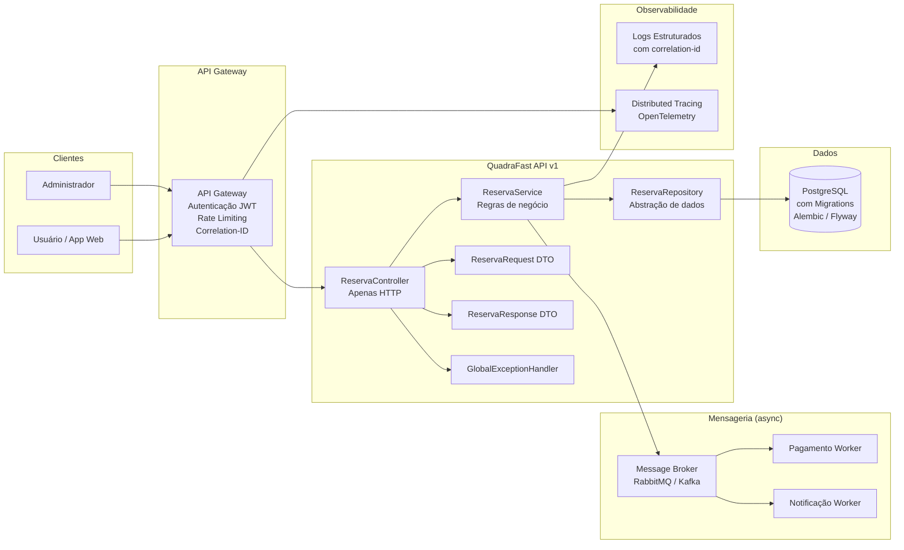

# QuadraFast — Diagnóstico Arquitetural e Evolução de APIs

## Como rodar

```bash
pip install -r requirements.txt
uvicorn app.main:app --reload
# Docs disponíveis em: http://localhost:8000/v1/docs
```

---

## Parte 1 — Diagnóstico Arquitetural

### Problemas identificados na arquitetura atual

#### Problema 1 — Controller Gigante (God Controller)
O `ReservaController` acumula regras de negócio, validações e acesso direto a dados em uma única classe. Isso viola o **Single Responsibility Principle**: qualquer mudança em qualquer camada exige mexer no controller inteiro. O risco é alto: uma correção simples pode quebrar funcionalidades não relacionadas.

#### Problema 2 — Endpoints não seguem REST
Endpoints como `/criarReserva` e `/buscarReservas` usam verbos na URL, o que é uma antipattern REST. A semântica HTTP já carrega o verbo (`POST`, `GET`). Contratos inconsistentes forçam os consumidores da API a ler documentação específica para cada endpoint — aumentando o custo de integração.

#### Problema 3 — Sem DTOs / Entidade exposta
O sistema expõe diretamente a entidade de domínio nas respostas e aceita ela como entrada. Isso cria acoplamento forte entre a camada de apresentação e o banco de dados: mudar um campo no modelo de dados quebra o contrato da API. Campos sensíveis (como senhas ou tokens internos) podem vazar inadvertidamente.

#### Problema 4 — Sem tratamento padronizado de erros
Cada parte do código lança erros de forma diferente, sem um contrato de resposta consistente. O consumidor da API não consegue tratar erros de forma programática — cada erro pode ter uma estrutura diferente, dificultando integrações e depuração.

#### Problema 5 — Alto acoplamento entre serviços (chamadas síncronas)
O `ReservaService` chama o serviço de pagamento e de notificação de forma **síncrona e obrigatória**. Se o serviço de pagamento estiver fora do ar, a reserva falha inteiramente — mesmo que o pagamento pudesse ser processado depois. Isso cria uma cadeia de falha em cascata e reduz a disponibilidade do sistema.

#### Problema 6 — Banco de Dados sem migrations
O banco é alterado manualmente, sem controle de versão do schema. Isso torna impossível rastrear o histórico de mudanças estruturais, reproduzir o ambiente em outro servidor ou fazer rollback seguro após uma alteração problemática.

#### Problema 7 — Sem observabilidade
Logs simples sem `correlation-id` impossibilitam rastrear uma requisição através de múltiplos serviços. Em caso de erro em produção, identificar a causa raiz se torna um trabalho de detetive — sem métricas, sem traces, sem contexto.

#### Problema 8 — Sem versionamento da API
A ausência de versionamento (`/v1/`, `/v2/`) significa que qualquer mudança no contrato da API é uma **breaking change** para todos os clientes. Não existe caminho de migração gradual.

---

### Riscos e impactos

| Problema | Risco Principal | Impacto em Escala |
|---|---|---|
| God Controller | Regressões frequentes | Alto: toda mudança é arriscada |
| Sem REST semântico | Integrações confusas | Médio: documentação nunca suficiente |
| Entidade exposta | Vazamento de dados | Alto: risco de segurança real |
| Sem DTOs | Quebra de contrato involuntária | Alto: mudança de DB quebra API |
| Sem padronização de erros | Integrações frágeis | Alto: clientes não sabem o que esperar |
| Acoplamento síncrono | Falha em cascata | Crítico: indisponibilidade total |
| Sem migrations | Schema incontrolável | Crítico: impossível reproduzir ambiente |
| Sem observabilidade | Debug impossível em produção | Alto: MTTR elevado |
| Sem versionamento | Breaking changes constantes | Alto: clientes quebram sem aviso |

---

## Parte 2 — Proposta de Solução

### Arquitetura proposta



### Decisões arquiteturais

**Separação de camadas**: Controller só lida com HTTP (status codes, serialização). Service concentra regras de negócio. Repository isola o acesso a dados. Cada camada pode evoluir independentemente.

**DTOs de entrada e saída**: A entidade de banco nunca é exposta diretamente. O DTO de request valida os dados na entrada; o DTO de response controla exatamente o que o cliente vê.

**Versionamento via prefixo de URL**: `/v1/reservas` permite lançar `/v2/reservas` sem quebrar clientes existentes.

**Migrations com Alembic**: Todo schema change vira um arquivo de migration versionado — rastreável, reversível e reproduzível.

**Comunicação assíncrona**: Pagamento e notificação são enfileirados via message broker. A reserva é confirmada imediatamente; os workers processam em background. Elimina falha em cascata.

**Tratamento centralizado de erros**: Um `GlobalExceptionHandler` garante que todos os erros retornem o mesmo contrato JSON, independente de onde a exceção foi lançada.

**Observabilidade**: Logs estruturados com `correlation-id` injetado pelo API Gateway. Cada requisição pode ser rastreada de ponta a ponta.

---

## Parte 3 — Implementação

### Endpoint: `POST /v1/reservas`

### Estrutura do projeto

```
quadrafast/
├── app/
│   ├── main.py                        # Inicialização FastAPI + rotas + error handlers
│   ├── controllers/
│   │   └── reserva_controller.py      # Apenas HTTP: recebe, delega, responde
│   ├── services/
│   │   └── reserva_service.py         # Regras de negócio: validações, orquestração
│   ├── repositories/
│   │   └── reserva_repository.py      # Acesso a dados: busca quadra, verifica conflito, salva
│   ├── dtos/
│   │   └── reserva_dto.py             # CriarReservaRequest + ReservaResponse (Pydantic)
│   ├── models/
│   │   └── models.py                  # Entidades internas + dados em memória
│   └── errors/
│       ├── exceptions.py              # Exceções de domínio tipadas
│       └── handlers.py                # Handlers globais → contrato padronizado
└── requirements.txt
```

### Exemplo de uso

**Request:**
```http
POST /v1/reservas
Content-Type: application/json

{
  "quadra_id": 1,
  "usuario_id": 42,
  "inicio": "2026-05-21T10:00:00",
  "fim": "2026-05-21T11:00:00"
}
```

**Response 201 — Sucesso:**
```json
{
  "id": 1,
  "quadra_id": 1,
  "usuario_id": 42,
  "inicio": "2026-05-21T10:00:00",
  "fim": "2026-05-21T11:00:00",
  "status": "confirmada"
}
```

**Response 404 — Quadra não encontrada:**
```json
{
  "status": 404,
  "error": "QUADRA_NAO_ENCONTRADA",
  "message": "Quadra 99 não encontrada"
}
```

**Response 409 — Conflito de horário:**
```json
{
  "status": 409,
  "error": "CONFLITO_DE_HORARIO",
  "message": "Conflito de horário na quadra 1: 2026-05-21 10:00:00 → 2026-05-21 11:00:00"
}
```

---

## Perguntas Discursivas

### 1. Por que APIs REST devem possuir contratos padronizados?

Contratos padronizados são a base de confiança entre uma API e seus consumidores. Quando toda resposta — seja sucesso ou erro — segue a mesma estrutura, o cliente consegue escrever código de integração uma única vez e reutilizá-lo para qualquer endpoint. Sem padronização, cada endpoint se torna um caso especial: o desenvolvedor precisa ler a documentação de cada rota para saber o que esperar, e qualquer inconsistência vira um bug de integração difícil de depurar. Em sistemas distribuídos, onde múltiplos serviços consomem a mesma API, a falta de contrato padronizado multiplica o custo de manutenção — uma mudança de estrutura em um endpoint pode quebrar dezenas de consumidores de formas diferentes e imprevisíveis.

### 2. Qual a importância do uso de DTOs em APIs modernas?

DTOs (Data Transfer Objects) criam uma fronteira explícita entre o modelo interno da aplicação e o que é exposto para o mundo externo. Sem DTOs, a entidade de banco de dados é usada diretamente como input e output da API — isso significa que qualquer mudança no schema do banco (renomear um campo, adicionar uma coluna, remover um índice) automaticamente quebra o contrato da API. Com DTOs, essas duas camadas são independentes: o banco pode evoluir sem impactar os clientes, e a API pode adicionar campos calculados ou remover dados sensíveis sem tocar no modelo de dados. DTOs também servem como ponto central de validação de entrada, garantindo que dados inválidos nunca cheguem à camada de negócio.

### 3. O que é acoplamento arquitetural e quais impactos ele pode causar?

Acoplamento arquitetural é o grau de dependência entre componentes de um sistema. Quanto mais acoplado, mais uma mudança em um componente força mudanças em outros. No QuadraFast original, o `ReservaService` chama diretamente os serviços de pagamento e notificação de forma síncrona — se o serviço de pagamento cair, a reserva inteira falha, mesmo que nada do pagamento seja necessário para confirmar a quadra. Acoplamento alto também torna testes difíceis (não dá para testar o service sem subir os serviços externos), impede deploys independentes (um time não pode subir uma versão sem coordenar com todos os outros) e cria fragilidade sistêmica — o sistema é tão forte quanto seu componente mais fraco.

### 4. Explique a importância do versionamento de APIs.

APIs são contratos públicos. Uma vez que um cliente depende de uma API, qualquer mudança incompatível é uma quebra — o cliente para de funcionar sem aviso. O versionamento (`/v1/`, `/v2/`) resolve isso criando isolamento temporal: a versão antiga continua funcionando enquanto os clientes migram gradualmente para a versão nova. Sem versionamento, o time fica preso: não pode evoluir a API sem quebrar clientes, e não pode deixar a API estagnada sem acumular dívida técnica. Em ambientes com múltiplos consumidores (apps mobile, parceiros, front-ends diferentes), o versionamento é o que permite que a API evolua em velocidade própria sem criar dependências de release sincronizado com todos os consumidores.

### 5. Por que migrations são importantes em aplicações modernas?

Migrations são o controle de versão do banco de dados. Sem elas, o schema do banco vive apenas na cabeça dos desenvolvedores ou em scripts SQL soltos, sem histórico, sem autoria e sem possibilidade de rollback. Em um time, isso significa que cada desenvolvedor pode ter um banco em estado diferente, levando a bugs que só aparecem em produção. Com migrations (Alembic, Flyway, Liquibase), cada mudança no schema é um arquivo versionado, rastreado no Git, executado de forma determinística em qualquer ambiente — desenvolvimento, staging ou produção. Isso garante que o ambiente de desenvolvimento seja um espelho fiel da produção, que deploys sejam reproduzíveis e que qualquer migração problemática possa ser revertida com segurança.

---

*CP3 — FIAP 3ESPR 2026 | Profa. Damiana Costa*
